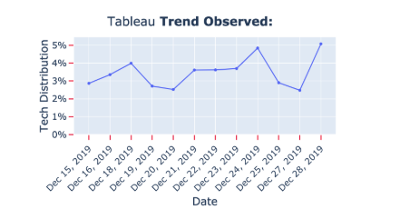

#  Predicting Technology Trends
**Using Natural Language Processing and Deep Learning to predict upcoming technology trends based on web-scraped data and a growing database of jobs posted from LinkedIn/Indeed.**

## Motivation

This project seeks to create opportunities and solve challenges for:
* Recruiting Firms: Solving the Pipeline Frustration
* Growing Companies: Planning Accurate Tech Roadmaps
* Job Seekers: Acquiring Emerging Tech Skills

## Tech Framework 

* Data Mining: Python, Pandas, BeautifulSoup, HTML/CSS. 
* Data Storage: SQLite, BigQuery.
* Visualizations: Plotly, DeckGL, Mapbox, [Streamlit](https://www.streamlit.io/). 
* Machine Learning: Natural Language Processing (Trigrams), LSTM/Softmax, Time-Series; Keras and NLTK.

# How-to Guide

This is a 'demo' version of the original project. I have removed the web scraping applications to avoid overloading LinkedIn/Indeed servers but I'm happy to share that code as well. 

Streamlit is an exciting and user-friendly platform built for Data Scientists who seek a professional avenue to display projects without the need to learn additional programming skills. I am not associated with or endorsed by Streamlit but suggest others try it out to experience it as well. With that said, this project will not work properly without first installing [Streamlit](https://www.streamlit.io/). 

The rest is simple: 
* Enter a position of interest (limited to tech positions for now). 

* Examine the database results from previous data mining as well as the real-time web scraping of current results. 

* Explore the locations of the random samples across the US. 

* Examine the emerging technologies identified by the NLP/Deep Learning algorithm. 

* Notice the trends over time for particular skills related to the position of interest. 

 

# Summary

The Capstone Project and project review are the most critical part of the program. They give you a chance to both bring together all the skills you've learned into realistic projects and to practice key "business judgement" and communication skills that you otherwise might not get as much practice with.  Most importantly, they provide employers with very strong signal about your technical abilities, and allow you to show the world what an amazing Data Scientist you've become!

The projects are serious and important. They are not graded, but they can be passed and they can be failed. Take the project seriously, put the time in, ask for help from your peers or instructors early and often if you need it, and treat the review as a job interview and you'll do great. We're rooting for you to succeed and we're only going to ask you to take a review again if we believe that you need to. We'll also provide open and honest feedback so you can improve as quickly and efficiently as possible.

We don't expect you to remember all of the terms or to get all of the answers right. If in doubt, be honest. If you don't know something, say so. If you can't remember it, just say so. It's very unusual for someone to complete a project review without being asked a question they're unsure of, we know you might be nervous which may affect your performance. Just be as honest, precise and focused as you can be, and you'll do great!
